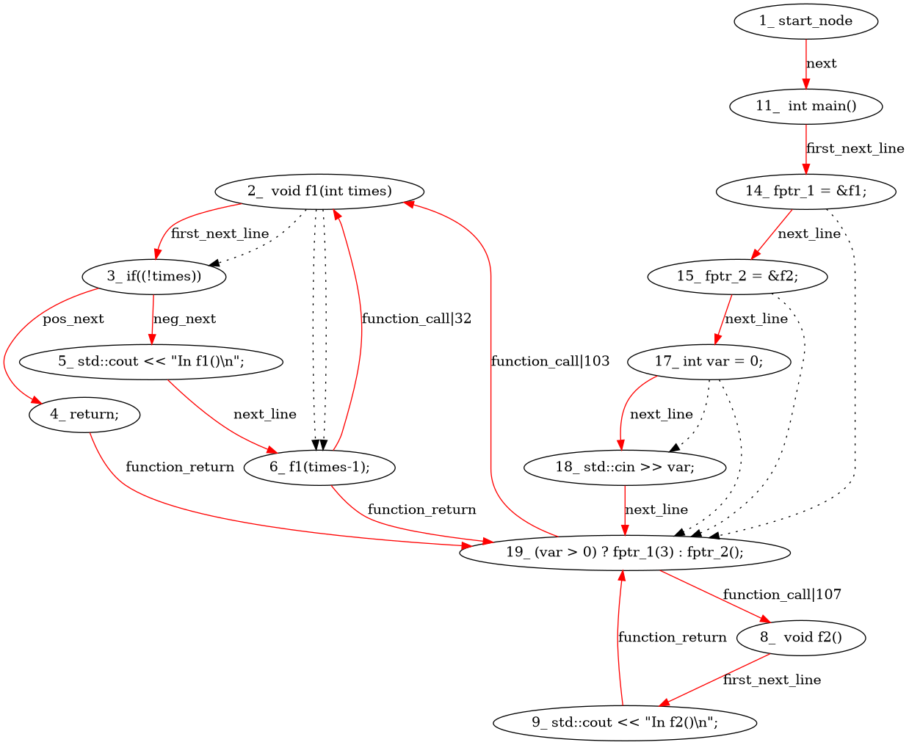
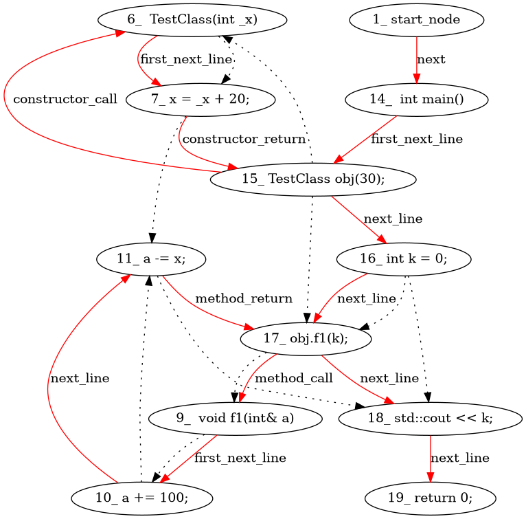

# ATLAS: Automated Tree-based Language Analysis System for C and C++ source programs

ATLAS (Automated Tree-based Language Analysis System) aims to generate combined multi-code view graphs that can be used with various types of machine learning models (sequence models, graph neural networks, etc).

## Overview

`ATLAS` is a CLI tool for generating customized source code representations from C and C++ programs. Currently, `ATLAS` generates codeviews for C and C++, supporting both method-level and file-level code snippets. `ATLAS` can be used to generate over 15 possible combinations of codeviews for both languages, including:

- **AST** (Abstract Syntax Tree)
- **CFG** (Control Flow Graph)
- **DFG** (Data Flow Graph)
- **SDFG** (Statement-level Data Flow Graph with Reaching Definitions)
- **Combined graphs** (any combination of the above)

`ATLAS` is designed to be easily extendable to various programming languages. This is primarily because we use [tree-sitter](https://tree-sitter.github.io/tree-sitter/), a highly efficient incremental parser that supports over 40 languages.

---
## Setup

There are two ways to set up ATLAS: using Docker (recommended for quick usage) or using a Python virtual environment (recommended for development).

### Option 1: Docker Setup (Recommended for Quick Usage)

Docker provides an isolated environment with all dependencies pre-installed.

**1. Build the Docker image:**
```console
docker build -t atlas .
```

That's it! You're ready to generate graphs using Docker.

### Option 2: Virtual Environment Setup (Recommended for Development)

**1. Create a new virtual environment:**
```console
python -m venv .venv
```

**2. Activate the environment:**
```console
source .venv/bin/activate  # On Linux/Mac
# or
.venv\Scripts\activate  # On Windows
```

**3. Install the package in development mode:**
```console
pip install -e .
```

**4. Install GraphViz (Optional - for visualization):**

GraphViz is only required if you want to generate DOT or PNG output files.

**Ubuntu/Debian:**
```console
sudo apt install graphviz
```

**MacOS:**
```console
brew install graphviz
```

**Windows:**
Download from [graphviz.org](https://graphviz.org/download/)

---
## Generating Graphs

There are two ways to generate graphs: using Docker or using the CLI directly (after virtual environment setup).

### Option 1: Using Docker

Docker commands mount your current directory to `/work` inside the container, so output files appear in your working directory.

**Single File Analysis:**
```console
docker run --rm -v "$(pwd):/work" -w /work atlas \
    --lang cpp \
    --code-file ./examples/single/test_single.cpp \
    --graphs "ast,cfg,dfg" \
    --output all
```

**Folder Analysis (Multi-file Projects):**
```console
docker run --rm -v "$(pwd):/work" -w /work atlas \
    --lang c \
    --code-folder ./examples/multi \
    --combined-name "multi_file_example" \
    --graphs "cfg,dfg" \
    --output all
```

**With Additional Options:**
```console
# Generate only JSON output
docker run --rm -v "$(pwd):/work" -w /work atlas \
    --lang c \
    --code-file ./examples/single/test_single.c \
    --graphs cfg \
    --output json

# With collapsed nodes and last-def tracking
docker run --rm -v "$(pwd):/work" -w /work atlas \
    --lang c \
    --code-file ./examples/single/test_single.c \
    --graphs "dfg" \
    --collapsed \
    --last-def
```

### Option 2: Using CLI Directly

After setting up via virtual environment, use the `atlas` command directly.

**Output Location:** All generated files (JSON, DOT, PNG) are saved to the `output/` directory in your current working directory. The directory is created automatically if it doesn't exist.

The attributes and options supported by the CLI are well documented and can be viewed by running:
```console
atlas --help
```

**Single File Analysis:**

Generate a combined CFG and DFG graph for a C++ file:
```console
atlas --lang "cpp" --code-file ./test.cpp --graphs "cfg,dfg"
```

Generate an AST for a C file with output in JSON format:
```console
atlas --lang "c" --code-file ./example.c --graphs "ast" --output "json"
```

**Folder Analysis (Multi-file Projects):**

ATLAS can analyze entire projects by combining multiple source files from a folder:

```console
atlas --lang "c" --code-folder ./project/src --graphs "cfg,dfg" --output "json"
```

This will:
1. Recursively scan the folder for all `.c` and `.h` files
2. Combine them into a single temporary file (preserving includes, declarations, definitions)
3. Generate the requested codeviews from the combined source
4. Output results to the `output/` directory

You can customize the combined output file name:
```console
atlas --lang "cpp" --code-folder ./mylib --combined-name "myproject" --graphs "ast,cfg"
```

**Inline Code Analysis:**

You can also analyze code snippets directly without a file:
```console
atlas --lang "c" --code "int main() { int x = 5; return x; }" --graphs "ast,cfg"
```

**Additional CLI Options:**

| Option | Description |
|--------|-------------|
| `--output` | Output format: `json`, `dot`, or `all` (dot also generates PNG). Default: `all` |
| `--collapsed` | Collapse duplicate variable nodes into a single node in DFG |
| `--last-def` | Add last definition information to DFG edges (shows where variables were last defined) |
| `--blacklisted` | Comma-separated list of AST node types to exclude from the graph |

**Flag-Codeview Compatibility:**

| Flag | AST | CFG | DFG |
|------|:---:|:---:|:---:|
| `--collapsed` | ✓ | ✗ | ✗ |
| `--blacklisted` | ✓ | ✗ | ✗ |
| `--last-def` | ✗ | ✗ | ✓ |
| `--last-use` | ✗ | ✗ | ✓ |

**Examples:**

```console
# Generate all output formats (DOT, JSON, PNG)
atlas --lang "c" --code-file test.c --graphs "cfg" --output "all"

# Collapse duplicate variable nodes in DFG
atlas --lang "cpp" --code-file test.cpp --graphs "ast" --collapsed

# Add last definition tracking to DFG
atlas --lang "c" --code-file test.c --graphs "dfg" --last-def

# Exclude specific AST node types
atlas --lang "c" --code-file test.c --graphs "ast,cfg" --blacklisted "comment,string_literal"
```

---
## Limitations

While `ATLAS` provides _method-level_ and _file-level_ support for both C and C++, it's important to note the following limitations and known issues:

### General Limitations
- **Syntax Errors in Code**: To ensure accurate codeviews, the input code must be free of syntax errors. Code with syntax errors may not be correctly parsed and displayed in the generated codeviews. Note that the code does not need to be compilable, only syntactically valid.

### C++ Specific Limitations
In addition to the general limitations, the tool has the following limitations specific to C++:

- **Limited Template Metaprogramming Support**: Complex template metaprogramming patterns may not be fully captured in the generated codeviews.

- **Partial Preprocessor Directive Support**: Preprocessor directives (e.g., `#define`, `#ifdef`) are parsed but not fully processed. Conditional compilation may not be accurately reflected in the codeviews.

- **Limited Support for Advanced C++ Features**: Some advanced C++ features such as:
  - Complex inheritance hierarchies
  - Multiple inheritance with virtual functions
  - Template specializations
  - SFINAE patterns
  - Concepts (C++20)

  may not be fully represented in the generated codeviews.

---

## Output Examples

### Example 1: C++ Function Pointers and Control Flow

**CLI Command**:

```bash
atlas --lang "cpp" --code-file paper_assets/function_pointers.cpp --graphs "cfg,dfg"
```
---

**C++ Code Snippet** ([function_pointers.cpp](paper_assets/function_pointers.cpp)):

```cpp
#include <iostream>
void f1(int times) {
    if(!times)
        return;
    std::cout << "In f1()\n";
    f1(times-1);
}
void f2() {
    std::cout << "In f2()\n";
}
int main() {
    void (*fptr_1)(int);
    void (*fptr_2)(void);
    fptr_1 = &f1;
    fptr_2 = &f2;

    int var = 0;
    std::cin >> var;
    (var > 0) ? fptr_1(3) : fptr_2();
}
```
---

**Generated Codeview**:



---

### Example 2: C++ Class with Pass-by-Reference

**CLI Command**:

```bash
atlas --lang "cpp" --code-file paper_assets/pass_by_reference.cpp --graphs "cfg,dfg"
```
---

**C++ Code Snippet** ([pass_by_reference.cpp](paper_assets/pass_by_reference.cpp)):

```cpp
#include <iostream>

class TestClass {
public:
    int x;
    TestClass(int _x) {
        x = _x + 20;
    }
    void f1(int& a) {
        a += 100;
        a -= x;
    }
};
int main() {
    TestClass obj(30);
    int k = 0;
    obj.f1(k);
    std::cout << k; // prints 50
    return 0;
}
```
---

**Generated Codeview**:



---

## Code Organization

The code is structured in the following way:

1. **Preprocessing** (`src/atlas/utils/`): The `multi_file_merger.py` module combines multiple source files from a folder into a single file for analysis.

2. **Parsing** (`src/atlas/tree_parser/`): For each code-view, first the source code is parsed using the tree-sitter parser. The Parser and ParserDriver are implemented with various functionalities commonly required by all code-views. Language-specific features are further developed in the language-specific parsers (`c_parser.py`, `cpp_parser.py`).

3. **Codeview Generation** (`src/atlas/codeviews/`): This directory contains the core logic for the various codeviews:
   - `AST/` - Abstract Syntax Tree (language-agnostic)
   - `CFG/` - Control Flow Graph (language-specific: `CFG_c.py`, `CFG_cpp.py`)
   - `DFG/` - Data Flow Graph (language-agnostic)
   - `SDFG/` - Statement-level Data Flow Graph (language-specific: `SDFG_c.py`, `SDFG_cpp.py`)
   - `combined_graph/` - Combines multiple codeviews into a single graph

4. **CLI Entry Point** (`src/atlas/cli.py`): The CLI implementation using Typer. The drivers can also be directly imported and used as a Python package.

5. **Node Definitions** (`src/atlas/utils/`): `c_nodes.py` and `cpp_nodes.py` define AST node type categorizations used throughout the codebase.

---

## Acknowledgments

This tool builds upon the tree-sitter parsing framework and is inspired by research on source code representation learning for AI-driven software engineering tasks.
